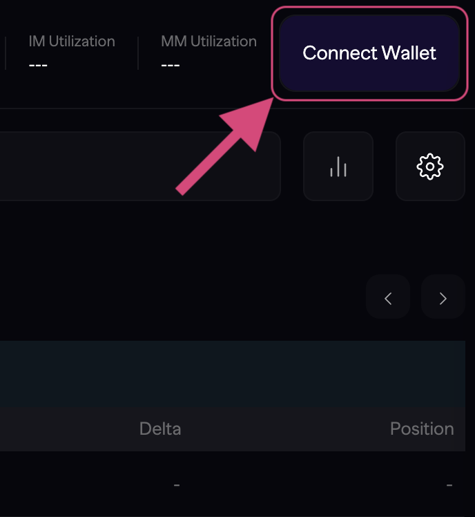
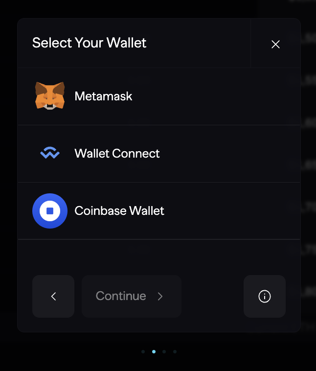
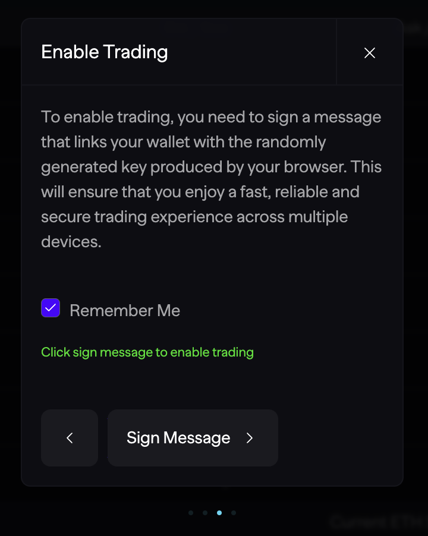
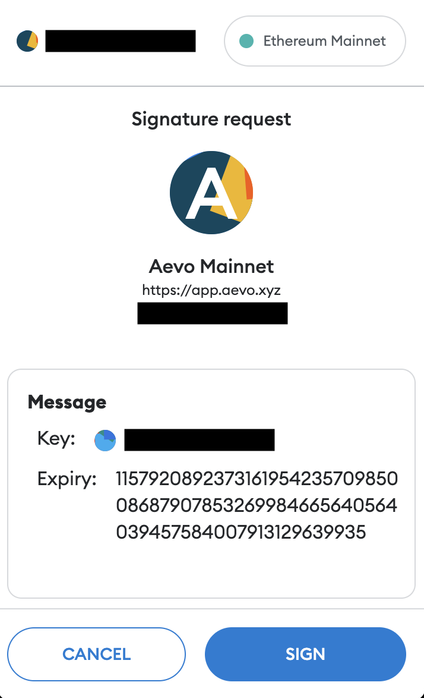
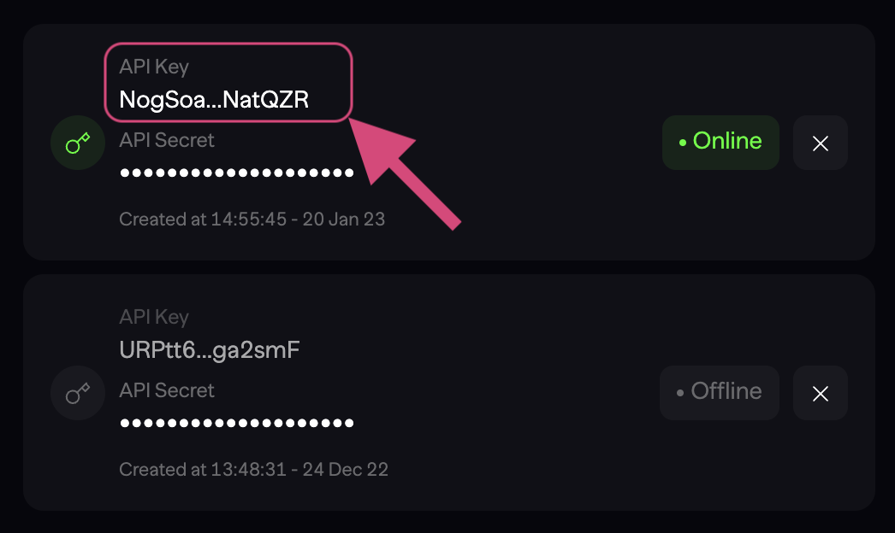

# Alethieum Aevo SDK


## Welcome to the Alethieum Aevo SDK!

The Alethieum Aevo SDK is a Python library that provides developers with a simple and efficient way to programmatically connect to the Aevo exchange. The SDK includes public functions, order execution strategies, and trading bots like Gridbots, enabling developers to build custom trading applications and automate their trading strategies on Aevo.

The SDK is currently in beta. We are working on adding more features and functions to the SDK, including support for more order execution strategies and trading bots. Please stay tuned for updates and of course let us know if you have any suggestions or feedback!

You can provide feedback by completing this form: https://alethieumlabs.deform.cc/aevofeedback - All users that complete the form will be eligible for a airdropped an NFT from the Alethieum DAO (Rewards for holding?)!

## Introduction to Aevo

Aevo is a high-performance decentralized derivatives exchange, focused on options. The exchange runs on a custom EVM roll-up that rolls up to Ethereum. Aevo operates an off-chain orderbook with on-chain settlements. This means that once orders are matched, trades get executed and settled with smart contracts. This allows Aevo to achieve high throughput and low latency, while still maintaining the security of on-chain settlements.

## Features & Functions

- **Real-time market data:** The SDK provides real-time market data for all instruments on the Aevo exchange, including order book data, trade data, and ticker data.

- **Order execution strategies:** The SDK includes several order execution strategies, including market orders, limit orders, and stop orders. These strategies can be used to automate trading and execute orders based on specific market conditions.

- **Trading bots:** The SDK includes several trading bots, including Gridbots, which can be used to automate trading and execute orders based on specific market conditions.

- **Webhooks:** The SDK supports webhooks, which can be used to receive real-time updates on market data and order execution events.


The SDK includes the following functions:

- `get_instruments()`: Returns a list of all instruments on the Aevo exchange.

- `get_order_book(instrument_id)`: Returns the order book data for a specific instrument.

- `get_trades(instrument_id)`: Returns the trade data for a specific instrument.

- `get_ticker(instrument_id)`: Returns the ticker data for a specific instrument.

- `place_market_order(instrument_id, side, quantity)`: Places a market order for a specific instrument.

- `place_limit_order(instrument_id, side, quantity, price)`: Places a limit order for a specific instrument.

- `place_stop_order(instrument_id, side, quantity, stop_price)`: Places a stop order for a specific instrument.

- `cancel_order(order_id)`: Cancels an existing order.

- `get_order(order_id)`: Returns information about an existing order.

- `get_orders()`: Returns a list of all open orders.

- `get_order_history()`: Returns a list of all filled and cancelled orders.

- `get_account()`: Returns information about the user's account.

- `get_balance(currency)`: Returns the user's balance for a specific currency.

- `get_deposit_address(currency)`: Returns the user's deposit address for a specific currency.

- `withdraw(currency, amount, address)`: Withdraws a specific amount of a currency to a specific address.

- `sign_order(instrument_id, is_buy, limit_price, quantity)`: Signs an order for a specific instrument using the user's private key.

For more information on how to use these functions, please refer to the documentation.

## Getting Started

Before you start using the SDK, you will need to create an account on the Aevo exchange. You can do so by visiting the [Aevo website](https://app.aevo.xyz/r/Curved-Bumpy-Robbins) and then following these steps:

1 - Go to: https://app.aevo.xyz/r/Curved-Bumpy-Robbins (This sign up links give you 10% discount for 6 months on trading fees)

Once there we can enable trading...

2 - Go to Aevo App and connect your wallet. The button can be found on the top right-hand corner.



3 - Connect your wallet using either Metamask, Wallet Connect or Coinbase Wallet.



4 - Click the Sign Message button. Optionally, you can disable Remember Me which only generates a temporary session key for trading.



5 - Sign the message from your wallet. Below is an example of how it looks like on Metamask



6 - Finally, you will be able to deposit USDC from the network.


You can now start trading on Aevo!

## Installation

To install the SDK, you can use the poetry package manager. First, make sure you have poetry installed on your system. Then, create a virtual environment using the following command:

```python
poetry shell
```

This will create a new virtual environment and activate it. Next, navigate to the root directory of the SDK and run the following command:

```python 
poetry install
```
This will install the SDK and all of its dependencies in your virtual environment.

## Configuration
Before you can use the SDK, you need to configure it with your API key and secret. You will need to generate an API key and secret. You can do so by following the steps below:

1 - Go to: https://app.aevo.xyz/settings/api-keys

Click on the API key you want to copy. This will automatically add the secret to your clipboard, ready for you to use. Similarly, you can do the same for your API secret.



Once you have these, open the clientConfig.py file in the root directory of the SDK and fill in the following fields:

- `signing_key`: Your private key for signing orders.
- `wallet_address`: The address of your wallet on the Aevo exchange.
- `api_key`: Your API key for accessing the Aevo API.
- `api_secret`: Your API secret for accessing the Aevo API.
- `env`: The environment you want to use (either "mainnet" or "testnet").

Make sure to save the `clientConfig.py` file after filling in the fields.

Note: It is important to keep your API key and secret secure. If someone gains access to your API key and secret, they could potentially access your Aevo account and perform actions on your behalf, including buying and selling assets. Make sure to keep your API key and secret in a secure location and do not share them with anyone. clientConfig.py is in the .gitignore file so it will not be pushed to github.

## Usage

Head to aevoGridbot.py, where you will find a Gribot ready to be used

I have also provided a place order example in the aevoPlaceOrder.py file

To run the Gridbot, simply run the following command:

```python
poetry run python aevoGridbot.py
```

# Gridbot Parameters

The `aevo_gridbot()` function takes the following parameters:

- `instrument_id`: The ID of the instrument to trade (e.g. "ETH-USD").
- `grid_levels`: The number of grid levels to use.
- `grid_spacing`: The spacing between grid levels, as a percentage of the current price.
- `order_size`: The size of each order, in the base currency (e.g. ETH for "ETH-USD").
- `max_orders`: The maximum number of orders to place on each side of the order book.
- `min_price`: The minimum price to place orders at.
- `max_price`: The maximum price to place orders at.
- `order_type`: The type of order to place (either "limit" or "market").
- `order_side`: The side of the order book to place orders on (either "buy" or "sell").
- `order_ttl`: The time-to-live for each order, in seconds.

Make sure to set these parameters appropriately for your trading strategy.

I hope this helps! Let me know if you have any further questions or need any more assistance! I'm happy to help! The strategy and parameters are always yours!
## Support

Alethieum has a Discord server where you can ask questions and get support. You can join the Discord server by clicking on the following link: https://discord.gg/WXb6H6U4EB

Please use the channel #aevo-sdk in the support sections for any questions related to the SDK.
## Roadmap

The SDK is currently in beta. We are working on adding more features and functions to the SDK, including support for more order execution strategies and trading bots. Please stay tuned for updates and of course let us know if you have any suggestions or feedback!

## Goodbye

Thank you! I hope you found this useful and that it helps you get started with the SDK. If you have any questions or feedback, please let me know in the comments below. I'm always happy to help! Happy trading!


## License

The AlethieumAevoSDK is licensed under the MIT License. See the [LICENSE](LICENSE) file for more information.

The MIT License (MIT)

Copyright (c) [2023] [Alethieum]

Permission is hereby granted, free of charge, to any person obtaining a copy of this software and associated documentation files (the "Software"), to deal in the Software without restriction, including without limitation the rights to use, copy, modify, merge, publish, distribute, sublicense, and/or sell copies of the Software, and to permit persons to whom the Software is furnished to do so, subject to the following conditions:

The above copyright notice and this permission notice shall be included in all copies or substantial portions of the Software.

THE SOFTWARE IS PROVIDED "AS IS", WITHOUT WARRANTY OF ANY KIND, EXPRESS OR IMPLIED, INCLUDING BUT NOT LIMITED TO THE WARRANTIES OF MERCHANTABILITY, FITNESS FOR A PARTICULAR PURPOSE AND NONINFRINGEMENT. IN NO EVENT SHALL THE AUTHORS OR COPYRIGHT HOLDERS BE LIABLE FOR ANY CLAIM, DAMAGES OR OTHER LIABILITY, WHETHER IN AN ACTION OF CONTRACT, TORT OR OTHERWISE, ARISING FROM, OUT OF OR IN CONNECTION WITH THE SOFTWARE OR THE USE OR OTHER DEALINGS IN THE SOFTWARE.
